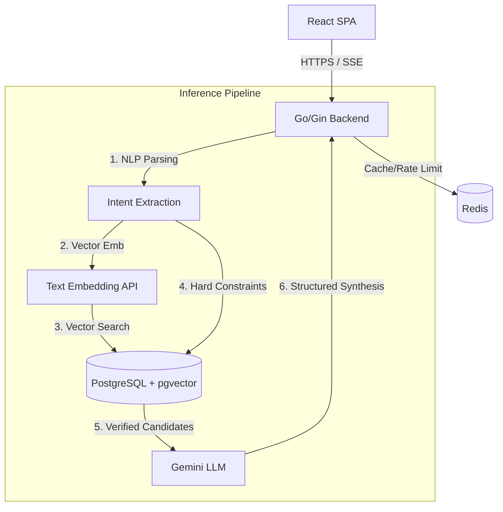
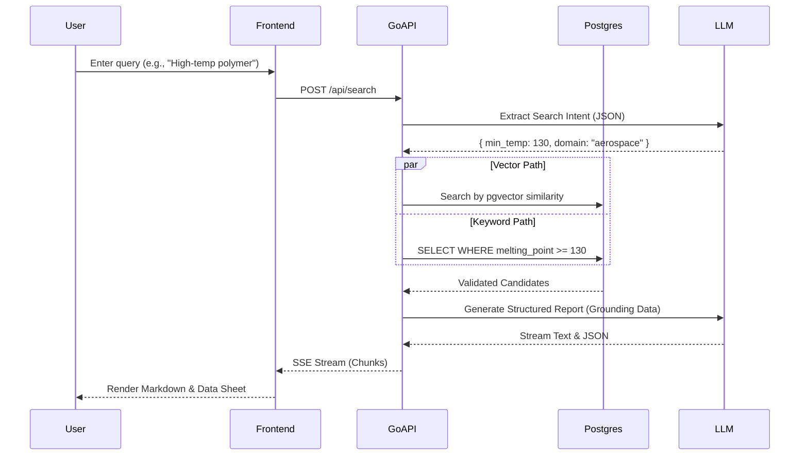

# Materials Mind

## Overview
Materials Mind is an elite technical intelligence console for hardware engineering. It translates complex physical constraints into deterministic, physics-grounded material recommendations backed by structured data. Designed as an AI-powered "Materials Scientist in the Loop," the platform accelerates the material selection process for aerospace, automotive, and advanced manufacturing workflows.

## Problem Statement
Hardware engineers must navigate intricate trade-offs—such as thermal limits, tensile strength, weight, and budget constraints—when selecting materials. Traditional catalogs rely on rigid, keyword-based search and manual cross-referencing. While Large Language Models (LLMs) offer natural language interaction, they are prone to dangerous hallucinations in mission-critical engineering contexts. 

Materials Mind solves this by employing a **Zero Hallucination Architecture**. It extracts physical constraints from natural language, verifies them against a strict, deterministic database using hybrid search, and then grounds the LLM synthesis exclusively in the verified data.

## Key Features
- **Hybrid RAG Inference Engine**: Seamlessly combines high-dimensional vector search with strict SQL-based parametric filtering.
- **Deterministic Physics Validation**: Candidates failing extracted physical boundaries (e.g., *Yield Strength > 400MPa*) are systematically pruned before reaching the LLM context window.
- **Real-Time Streaming Synthesis**: Utilizes Server-Sent Events (SSE) to stream detailed, structured engineering reports with sub-second latency.
- **Persistent Conversational Context**: Users can iterate on constraints or challenge trade-offs within isolated chat sessions.
- **Enterprise-Grade Authentication**: OAuth2 integration with secure session management.

## Architecture Overview

The system utilizes a modern, decoupled client-server architecture:
1. **Frontend**: A highly responsive React/TypeScript Single Page Application (SPA) utilizing Zustand for state management and TailwindCSS for a premium, Carbon-inspired technical UI.
2. **Backend API**: A highly concurrent Go/Gin server handling request orchestration, streaming, and business logic.
3. **Data Layer**: PostgreSQL with `pgvector` for hybrid storage, fronted by PgBouncer for connection pooling, and Redis for aggressive response caching and rate limiting.

## System Design



### Core Workflows



## Technology Stack

- **Frontend**: React 18, TypeScript, Vite, TailwindCSS, Zustand, Lucide React, React Markdown.
- **Backend**: Go 1.22, Gin Web Framework, Goth (OAuth2), Gorilla Sessions.
- **Database**: PostgreSQL 16, pgvector extension, PgBouncer.
- **Caching & KV**: Redis Stack.
- **AI / LLM**: Google Gemini (gemini-2.5-flash) via `generative-ai-go`.
- **Infrastructure**: Docker, Docker Compose, NGINX.

## Folder Structure

```text
Materials_Mind/
├── backend/
│   ├── domain/         # Core business models and structs
│   ├── handlers/       # HTTP controllers (API endpoints)
│   ├── middleware/     # Auth, Rate Limiting, CORS
│   ├── repositories/   # Postgres/pgx data access layer
│   ├── services/       # Core business logic and LLM orchestration
│   ├── utils/          # JWT, environment helpers
│   └── main.go         # Application entry point
├── frontend/
│   ├── src/
│   │   ├── api/        # Axios API client and SSE stream parsers
│   │   ├── components/ # Reusable UI, ChatPanel, DataSheet
│   │   ├── hooks/      # Custom React hooks (useChat)
│   │   ├── pages/      # Route entry points (AuthPage, ChatPage)
│   │   └── store/      # Zustand state management
├── data/               # SQL schemas and DB initialization
└── docker-compose.yml  # Local infrastructure orchestration
```

## Database Design

The application relies on a strictly relational schema with vector support:

- `users`: Core identity table (BIGSERIAL PK).
- `chats`: Represents an isolated conversation session (FK `user_id`).
- `messages`: Chronological conversation turns (FK `chat_id`).
- `materials`: Highly structured material property rows (e.g., `density`, `yield_strength`).
- `material_embeddings`: High-dimensional vector representations of material descriptions.

## API Documentation

### Public Routes
- `GET /health` - API health check.
- `GET /api/auth/google/login` - Initiate Google OAuth2 flow.
- `GET /api/auth/google/callback` - Handle OAuth2 redirect.

### Protected Routes (Requires JWT Session)
- `GET /api/auth/me` - Retrieve current user profile.
- `POST /api/auth/logout` - Invalidate session.
- `POST /api/chat/create` - Initialize a new chat session.
- `GET /api/chat/list` - Retrieve all user sessions.
- `GET /api/chat/:chat_id/messages` - Retrieve session history.
- `POST /api/chat/:chat_id/messages` - Append user message to history.
- `POST /api/search` - Execute Hybrid RAG query (Returns Server-Sent Events).
- `POST /api/chat/followup` - Query the LLM based on previous chat context.

## Authentication & Authorization

The system utilizes an **OAuth2 to JWT Session Cookie** flow. 
1. The user authenticates via Google Workspace (via the `goth` library).
2. The backend performs an `UPSERT` on the `users` table, explicitly validating the provider to prevent Account Takeover via provider confusion.
3. A stateless JWT is minted and set as a strict, `HTTP-Only`, `Secure` cookie (`session_token`).
4. Protected routes pass through the `RequireAuth` middleware, which decodes the JWT and sets the `user_id` in the Gin context.

## Environment Variables

| Variable | Description | Required |
|----------|-------------|----------|
| `PORT` | API Port (Default: 8080) | No |
| `DATABASE_URL` | PostgreSQL connection string | Yes |
| `REDIS_URL` | Redis connection string | Yes |
| `GEMINI_API_KEY` | Google Gemini API Key | Yes |
| `GOOGLE_CLIENT_ID` | Google OAuth2 Client ID | Yes |
| `GOOGLE_CLIENT_SECRET` | Google OAuth2 Secret | Yes |
| `JWT_SECRET` | Secret key for signing Session Cookies | Yes |
| `FRONTEND_ORIGIN` | Comma-separated list of allowed CORS origins | Yes |
| `BACKEND_URL` | Base URL for the API (used in OAuth callback) | Yes |

## Local Development Setup

1. **Clone the repository:**
   ```bash
   git clone https://github.com/organization/materials_mind.git
   cd materials_mind
   ```

2. **Start Infrastructure (DB & Redis):**
   ```bash
   docker-compose up -d postgres redis pgbouncer
   ```

3. **Backend Setup:**
   ```bash
   cd backend
   go mod download
   go run main.go
   ```

4. **Frontend Setup:**
   ```bash
   cd frontend
   npm install
   npm run dev
   ```

## Development Workflow

- The frontend utilizes Vite for rapid HMR (Hot Module Replacement).
- The backend relies on standard `go build`. Ensure `go test ./...` passes before pushing.
- Pre-commit hooks should be utilized to enforce `gofmt` and ESLint standards.

## Testing

- **Backend**: Standard Go testing framework (`go test`).
- **Frontend**: Currently reliant on manual E2E validation. 
- *Note: Integration tests for the LLM pipeline use mock interfaces to prevent exhausting API quotas.*

## Deployment

The application is container-ready. 
1. Build the frontend via `npm run build` and serve via NGINX.
2. Compile the Go binary for the target architecture (`GOOS=linux GOARCH=amd64`).
3. Deploy behind a Reverse Proxy (e.g., AWS ALB or NGINX) with TLS termination. Ensure `Secure` cookie flags are active.

## Monitoring & Logging

- Standard output logging via Go's `log` package.
- API requests passing through Gin are logged automatically.
- Redis acts as a fast cache for LLM outputs, which drastically reduces API costs and monitors repetitive queries.

## Security Considerations

- **XSS Protection**: Frontend markdown is strictly sanitized using `rehype-sanitize` before rendering LLM output.
- **Prompt Injection Defense**: System/Assistant roles in the database are strictly enforced by the backend; clients cannot inject historical context.
- **Rate Limiting**: Configured per `user_id` via Redis to prevent authenticated NAT-level Denial of Service.
- **SQL Injection**: All database queries utilize parameterized `pgx` executions.
- **Account Takeover**: OAuth provider validation is strictly enforced during upsert operations.

## Performance Optimizations

- **Streaming Architecture**: The UI utilizes Server-Sent Events to render LLM responses byte-by-byte, eliminating TTFB (Time to First Byte) blocking.
- **UI Layout Thrashing**: Textarea auto-resizing is debounced to 10ms to prevent browser thread locking during rapid typing.
- **Connection Pooling**: `PgBouncer` is utilized to multiplex Postgres connections efficiently.

## Scalability Considerations

The application is designed to scale horizontally. Because sessions are managed statelessly via JWT cookies and the LLM cache is centralized in Redis, multiple Go API nodes can be spun up behind a load balancer without sticky sessions. 

## Known Limitations

- **Stateless Search**: The initial `/search` endpoint does not inherently persist the generated response. The client is responsible for subsequently pushing the received message into the chat history via a POST request.
- **Hardcoded Prompts**: LLM system prompts are currently embedded within the Go source code, requiring a recompile to adjust personality or extraction parameters.

## Future Improvements

- Migrate hardcoded prompts to an external configuration table.
- Implement pagination for `GET /chat/:id/messages` to support infinitely long contexts.
- Add backend telemetry (e.g., OpenTelemetry) for granular latency tracing across the RAG pipeline.

## Contributing

1. Fork the repository.
2. Create a feature branch (`git checkout -b feature/amazing-feature`).
3. Commit your changes (`git commit -m 'Add amazing feature'`).
4. Push to the branch (`git push origin feature/amazing-feature`).
5. Open a Pull Request.

## License

Copyright © 2026. All Rights Reserved. Proprietary and confidential.
